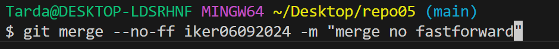
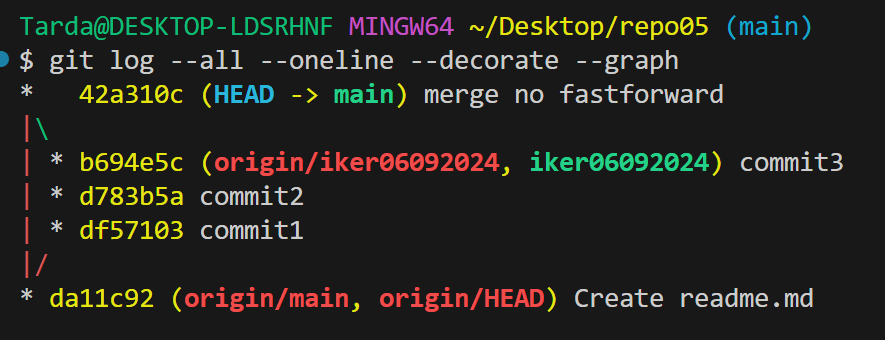
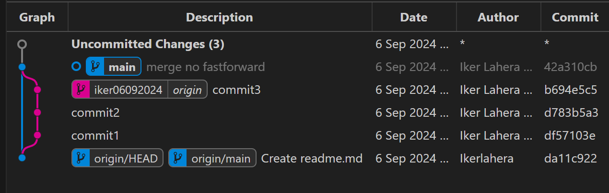

# Repositorio 5

Ejercicio de ramas no fastforward

Los primeros 3 puntos son los mismos que en el ejercicio anterior. 

Ahora subiremos la rama al remoto antes de hacer merge

Ahora hacemos mege sin fastforward

Este es el resultado